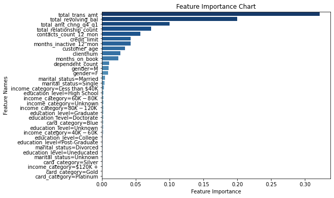
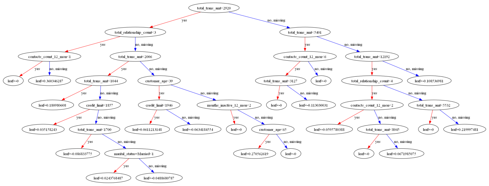

# Credit Card Churning Customers

## Description

Dataset found on [Kaggle](https://www.kaggle.com/datasets/sakshigoyal7/credit-card-customers)

Objective
The primary goal of this project is to develop a machine learning model capable of accurately predicting customer churn in a banking context. By analyzing historical data, the model will identify patterns and indicators that signal when a customer is likely to leave the bank. This foresight will enable the bank to implement targeted retention strategies, improving customer satisfaction and reducing churn rates.

Dataset Overview
The dataset, BankChurners.csv, consists of various attributes related to bank customers, including demographic information, account characteristics, and transaction details. Key features include:

- Personal attributes like age, gender, and education level.
- Banking details such as credit limit, account age, and transaction history.
- Behavioral indicators like months inactive and changes in transaction amounts.

Machine Learning Task
This is a binary classification problem where the target variable is the Attrition_Flag, indicating whether a customer has churned or not. The model will be trained to distinguish between 'Existing Customer' and 'Attrited Customer' based on the features provided.

Proposed Methodology
1. Data Preprocessing:
- Handle missing values and outliers.
- Encode categorical variables.
- Normalize or standardize numerical features.
- Split data into training and testing sets.

2. Exploratory Data Analysis (EDA):
- Analyze the distribution of various features.
- Identify correlations between features and the target variable.
- Detect and explore any patterns or trends in the data.

3. Feature Selection and Engineering:
- Determine the most relevant features for churn prediction.
- Engineer new features if necessary to improve model performance.

4. Model Development:
- Experiment with various algorithms (e.g., Logistic Regression, Random Forest, Gradient Boosting).
- Use cross-validation to evaluate model performance.
- Tune hyperparameters to optimize models.

5. Model Evaluation:
- Assess model performance using appropriate metrics (e.g., accuracy, precision, recall, F1-score, ROC-AUC).
- Perform error analysis to understand model shortcomings.
- Model Deployment (if applicable):

6. Deploy the trained model for real-time predictions.
- Develop a monitoring system for model performance over time.
- Expected Outcomes

The project aims to deliver a robust machine learning model that predicts customer churn with high accuracy. This model will be a valuable tool for the bank's customer retention strategies, enabling targeted interventions for customers at high risk of churning.

Challenges and Considerations
- The imbalance in the dataset (if present) might require special techniques like oversampling, undersampling, or specialized algorithms.
- Ensuring that the model does not overfit to the training data and generalizes well to unseen data.
- Interpretability of the model is key, as it's important to understand why customers are predicted to churn for effective intervention strategies.

## EDA (Exploratory Data Analysis)

Here's an overview of the columns present:

- **CLIENTNUM:** A unique identifier for the client.
- **Attrition_Flag:** Indicates whether the customer is an existing customer or has churned.
- **Customer_Age:** Age of the customer.
- **Gender:** Gender of the customer.
- **Dependent_count:** Number of dependents.
- **Education_Level:** Education level of the customer.
- **Marital_Status:** Marital status of the customer.
- **Income_Category:** Income bracket of the customer.
- **Card_Category:** Type of card (e.g., Blue, Silver, Gold).
- **Months_on_book:** Number of months the customer has been with the bank.
- **Total_Relationship_Count:** Total number of products the customer has with the bank.
- **Months_Inactive_12_mon:** Number of months the customer has been inactive in the last 12 months.
- **Contacts_Count_12_mon:** Number of contacts with the customer in the last 12 months.
- **Credit_Limit:** Credit limit on the customer's card.
- **Total_Revolving_Bal:** Total revolving balance on the credit card.
- **Avg_Open_To_Buy:** Average open to buy credit line (difference between the credit limit and the revolving balance).
- **Total_Amt_Chng_Q4_Q1:** Change in transaction amount from Q4 to Q1.
- **Total_Trans_Amt:** Total transaction amount in the last 12 months.
- **Total_Trans_Ct:** Total number of transactions in the last 12 months.
- **Total_Ct_Chng_Q4_Q1:** Change in transaction count from Q4 to Q1.
- **Avg_Utilization_Ratio:** Average card utilization ratio.

Analysis of the categorical variables:

1. **Gender Distribution:** The dataset has a relatively balanced distribution between male and female customers.
2. **Dependent Count Distribution:** Most customers have between 0 to 3 dependents, with fewer customers having more than 3 dependents.
3. **Education Level Distribution:** A diverse range of education levels is present, with 'Graduate' being the most common, followed by 'High School' and 'Uneducated'. There's a significant number of customers with 'Unknown' education level.
4. **Marital Status Distribution:** 'Married' is the most common marital status, followed by 'Single' and 'Unknown'. A smaller number of customers are 'Divorced'.

Descriptive Statistics of Numerical Variables:

- **CLIENTNUM:** Customer's unique identifier. It ranges widely as expected for an ID number.
- **Customer_Age:** Ranges from 26 to 73 years, with an average of about 46 years.
- **Dependent_count:** Varies between 0 to 5 dependents, with an average of approximately 2.35.
- **Months_on_book:** The length of relationship with the bank, averaging about 36 months.
- **Total_Relationship_Count:** Number of products held by the customer, ranging from 1 to 6.
- **Months_Inactive_12_mon:** Number of inactive months in the last year, varies between 0 to 6 months.
- **Contacts_Count_12_mon:** Count of contacts in the last 12 months, between 0 to 6.
- **Credit_Limit:** Ranges significantly from about 1438 to 34516, indicating diverse customer profiles.
- **Total_Revolving_Bal:** The revolving balance on the credit card, varying widely among customers.
- **Avg_Open_To_Buy:** Average unused credit line, also shows a wide range.
- **Total_Amt_Chng_Q4_Q1:** Change in transaction amount, with a mean close to 0.76.
- **Total_Trans_Amt:** Total transaction amount, with a considerable range.
- **Total_Trans_Ct:** Total number of transactions, averaging around 65.
- **Total_Ct_Chng_Q4_Q1:** Change in transaction count, showing some variability.
- **Avg_Utilization_Ratio:** Card utilization ratio, ranging from 0 to 0.999.

### Risk Ratio

**Gender**
Female Customers (F) have a higher attrition rate (mean = 17.69%) than Male Customers (M, mean = 14.21%). The risk ratio for female customers is 1.102, indicating they are about 10% more likely to churn than the baseline.
Male Customers have a risk ratio less than 1 (0.885), suggesting they are less likely to churn compared to the baseline.

**Education Level**
Customers with a Doctorate have the highest risk ratio (1.422), meaning they are 42% more likely to churn than the average customer.

**Marital Status**
Divorced and Single customers have slightly higher risk ratios than 1, suggesting a marginally higher propensity to churn.
Married customers and those with Unknown marital status have a lower risk of churning (risk ratios below 1).

**Income Category**
The highest risk ratio is observed in the Unknown income category (1.115), followed by customers earning Less than $40K.
Customers in the $60K - $80K income bracket have the lowest risk ratio (0.850), indicating they are significantly less likely to churn.
Other income categories have risk ratios around 1, suggesting average churning tendencies.

**Card Category**
Customers with Platinum cards have a substantially higher risk ratio (2.077), indicating a very high likelihood of churning.
Gold cardholders also have a higher than average risk ratio.
Blue and Silver cardholders are less likely to churn, with Silver cardholders showing the lowest risk ratio (0.858).

### Feature Importance



**1. Total_Trans_Amt: (Total Transaction Amount)** appears to be the most important feature, with the highest importance score. This suggests that the amount a customer has spent is highly indicative of their likelihood to churn.
**2. Total_Revolving_Bal (Total Revolving Balance)** is the second most important feature. This reflects the part of a credit line that is carried from one month to the next, and a higher balance might indicate more active use of the bank's services or customer satisfaction.
**3. Total_Amt_Chng_Q4_Q1: (Total Amount Change from Q4 to Q1)** also has high importance. Significant changes in spending between these quarters might signal changes in a customer's financial behavior or satisfaction with the bank.
**4. Total_Trans_Amt: (Total Transaction Amount)** follows closely, suggesting that the total amount of money a customer transacts is a strong indicator of churn risk.
**5. Avg_Utilization_Ratio:** has a moderate importance score. This ratio indicates how much of the available credit is actually being used, which can be a signal of credit dependency or financial behavior.

## Model Training

The data was splitted into a train/validation/test split with a 60%/20%/20% ratio.

The first model was a Logistic Regression and the resulta was a ROC AUC score of 0.57

After that I tried a Decision Tree Model with a max depth of 3 that yielded a ROC AUC score of 0.779

A Random Forest Model was applied with a max depth of 8 and 1000 estimators, with a ROC AUC score of 0.738, in this step I have extracted the Feature Importance chart.

As a final model I used a XGBoost and tunned the parameters eta and max_depth, and found that the best parameters were eta=0.3 and max_depth=6, which yield a ROC AUC score of 0.96.


The dataset is highly imbalanced so I used a cross validation method to garantee that we are not overfitting out model.

## Exporting to a script

The final model was exported to a python file ([train](./code/train.py)), the code does the following: 

1. Import Libraries: Pandas, NumPy, scikit-learn, and XGBoost are imported.

2. Data Preparation:
- The dataset (BankChurners.csv) is loaded and preprocessed.
- Unnecessary columns are dropped, and some columns are filtered based on specific conditions.
- The target variable attrition_flag is converted into an integer format.
- Train-Test Split: The data is split into training and test sets using train_test_split from scikit-learn.

3. Feature Engineering:
- A list of features to be used in the model is defined.
- DictVectorizer is used for converting feature arrays into a format suitable for the XGBoost model.
- XGBoost Preparation: XGBoost-specific DMatrix data structures are created for both training and validation datasets.
XGBoost parameters are defined, including learning rate (eta), tree-specific parameters (max_depth, alpha, lambda, gamma).

4. Model Training and Prediction:
- An XGBoost model is trained on the dataset.
- Predictions are made on the validation set.

5. Model Validation and Saving:
- Cross-validation is performed using the XGBoost cv function to validate the model.
- The model, along with the DictVectorizer and feature names, is saved to a file using the pickle module.

## Flask API 

The code ([predict](./code/predict.py)) sets up a Flask web service for predicting the churning customers. It uses a pre-trained XGBoost regression model loaded from a binary file.

1. Import Libraries: The script imports necessary libraries, including pickle for loading the saved model, Flask-related functions, and XGBoost.

2. Model Loading:
It loads a pre-trained XGBoost model from a binary file (model_eta=0.1_max_depth=6_v0.947.bin). This file is assumed to contain a DictVectorizer object (dv), the trained model (model), and a list of feature names (features).

3. Flask App Initialization:
An instance of a Flask application is created with the name 'churn'.

4. Defining a Route for Predictions:
The application defines a route /predict that listens for POST requests.
When a POST request is received, it expects to get JSON data (info), which should contain the input features for the model.

5. Model Prediction:
The received data is transformed using the DictVectorizer (dv) to ensure it matches the format expected by the model.
A DMatrix is created from the transformed data, which is then used for making predictions using the pre-loaded XGBoost model.
The predicted probability (probability) of churn is rounded to one decimal place.
A churn flag (churn_flag) is determined based on whether the probability is greater than 0.5.

6. Returning the Result:
The result, containing the churn probability and a binary flag indicating whether churn is likely, is returned as a JSON response.

7. Running the App:
The Flask application runs on the host 0.0.0.0 (making it accessible from other machines) and listens on port 9696.
The debug=True mode is enabled, which is useful for development as it provides detailed error messages and enables live reloading

## Environment Management

To run this model locally, first clone the repo with the command:
```bash
git clone https://github.com/danietakeshi/ml-zoomcamp-capstone-project-1.git
```

Navigate to the folder `ml-zoomcamp-capstone-project-1/code`

The [code](./code/) folder has the Pipfile and the Pipfile.lock containing all the project dependencies, run the command below to install the necessary libraries
```bash 
pipenv install
```

To use the activate the environment run the command `pipenv shell`

## Docker

The [Dockerfile](./code/Dockerfile) is used to containerize a Python application that serves predictions for churning customers using Flask and Gunicorn. Here's a breakdown of the Dockerfile:

1. Base Image
- `FROM python:3.9.18-slim`  
  Specifies the base image for the container, using a slim version of Python 3.9.18. The slim image is smaller and more compact, making it suitable for production environments.

2. Installing Dependencies
- `RUN pip install pipenv`  
  Installs `pipenv`, a Python packaging tool that simplifies dependency management.

3. Setting the Working Directory
- `WORKDIR /app`  
  Sets the working directory inside the container to `/app`. All future commands will run in this directory.

4. Copying Dependency Files
- `COPY ["Pipfile", "Pipfile.lock", "./"]`  
  Copies the `Pipfile` and `Pipfile.lock` files from the project into the container. These files are used by `pipenv` to manage dependencies.

5. Installing Python Dependencies
- `RUN pipenv install --system --deploy`  
  Installs the dependencies specified in `Pipfile.lock` into the system Python environment. The `--deploy` flag ensures installation fails if `Pipfile.lock` is out-of-date, ensuring reproducible builds.

6. Copying Application Files
- `COPY ["predict.py", "model_eta=0.1_max_depth=6_v0.947.bin", "./"]`  
  Copies the application file (`predict.py`) and the pre-trained model file (`model_eta=0.1_max_depth=6_v0.947.bin`) into the container.

7. Exposing a Port
- `EXPOSE 9696`  
  Informs Docker that the container listens on port 9696, the port on which the Flask application runs.

8. Setting the Entry Point
- `ENTRYPOINT [ "gunicorn", "--bind=0.0.0.0:9696", "predict:app" ]`  
  Sets the default command to run when the container starts. Uses `gunicorn`, a Python WSGI HTTP Server, to serve the Flask application. The `--bind=0.0.0.0:9696` argument specifies the network interface and port, and `predict:app` indicates the application module and Flask app instance.

By building a Docker image from this Dockerfile and running a container, an isolated environment is created that contains the Flask application and all its dependencies, ready to handle requests on port 9696. This setup is ideal for consistent application deployment across different environments.

To use the Dockerfile we first need to create an image with the command:
```bash
docker build -t churn-pred .
```
and then we can run the container
```bash
docker run -it --rm -p 9696:9696 churn-pred
```

It is possible to run the script [predict_test](./code/predict-test.py) to test if the Flask API is working on the container.

```bash
python predict-test.py
```

It is possible to use a [Streamlit](./code/myapp.py) apllication to test the prediction using the command:
```bash
streamlit run myapp.py
```

## Cloud Deployment

Google Cloud Run is a serverless platform for deploying containerized applications. It allows you to run applications in lightweight containers without worrying about infrastructure management. To deploy an app using the `gcloud run deploy` command, you'll need to follow these steps:

1. **Set Up Google Cloud SDK:**
   - Before you can use `gcloud run deploy`, ensure you have the Google Cloud SDK installed and configured. If you haven't already, you can download and set up the SDK by following the instructions here: https://cloud.google.com/sdk/docs/install

2. **Build Your Container Image:**
   - First, ensure that you have a Docker container image for your application. You can create one using a Dockerfile that defines your app's dependencies and configuration. Make sure the Docker image is pushed to a container registry like Google Container Registry (GCR) or another container registry that Cloud Run can access.

3. **Deploy the App to Google Cloud Run:**
   - Open a terminal or command prompt.
   - Navigate to the root directory of your application where the Dockerfile is located.
   - Run the following `gcloud run deploy` command to deploy your app:

   ```bash
   gcloud run deploy churn-prob --port=9696 --source .
   ```

4. **Select Region:**
   - Choose a region where your service will be hosted. Google Cloud Run allows you to select a region where your service will be deployed. Choose the one that is geographically closest to your target audience for lower latency.

5. **Allow Unauthenticated Invocations:**
   - You will be asked if you want to allow unauthenticated invocations. Choose "y" or "n" based on your application's security requirements.

6. **Deployment Process:**
   - The `gcloud` command will build and deploy your container to Google Cloud Run. The deployment process may take a few minutes. You'll see progress messages in your terminal.

7. **Access the Service:**
   - Once the deployment is complete, you'll receive a URL where your service is hosted. You can access your application using this URL.
```bash
Service [churn-prob] revision [churn-prob-00001-yot] has been deployed and is serving 100 percent of traffic.
Service URL: https://churn-prob-234gh2nz6a-rj.a.run.app

#Test with Script
python predict-test.py "https://churn-prob-234gh2nz6a-rj.a.run.app"

#Test with Streamlit
streamlit run myapp.py "https://churn-prob-234gh2nz6a-rj.a.run.app"
```

Link to the screen recording of the Cloud Deployment
[](https://youtu.be/-VjZaG7cf7Y)